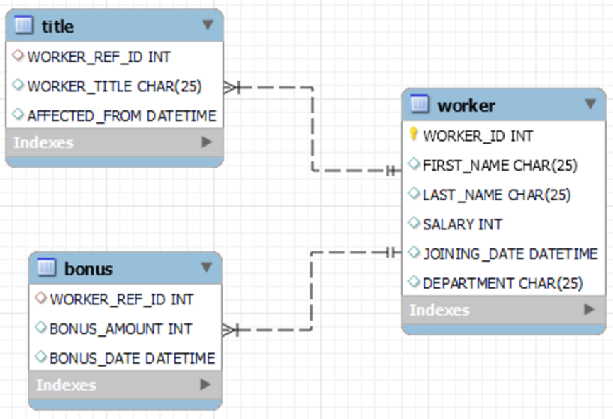

# CSC3170 Assignment 1

(Copied from https://oj.cuhk.edu.cn/d/csc3170_2024_fall/homework/66e149906605d3c4e7f52a12)

AS1 is now opened. It will be closed at 23:59 pm, September 30. You will get 20% points off if you delay within 2 days, and will get zero point if you delay over 2 days and cannot argue for it.

**Note: The SQL language utilized in the OJ system is SQLite, which is quite similar to MySQL.** Actually, you can directly use MySQL to write code in your computer, and copy your answer in the OJ system. If the submission cannot pass in OJ but can be run in your computer, you may change it slightly according to the syntax of SQLite. Besides, you can directly write code and use the self-testing to check your code by yourself in the OJ system.

Q1, Q2, and Q3 are questions that require you to create tables and insert records. You can do the **Run Pretest** to check if the your output meets the requirement, and please remember to press **Submit Solution** to submit. If the results is "AC", you will get 4-5 points per question (100 points in total). If not, you will get zero point for this question.

Q4 to Q23 are questions of writing queries. When doing the self-testing in these Questions, please copy all your answer codes in Q1, Q2, and Q3 in the self-testing area. In other words, the OJ system will not do the table creation and record insertion in self-testing in Q4 - Q23. But when you **Submit Solution**, you just need to write the SQL query (**and do not add the table creation and record insertion code anymore**) since in the grading period, the system will create tables and insert records before running your SQL query.

## Grading
How does the OJ system judge your answer? It will compare your output and the expected output mentioned in each question. If you cannot AC, please do the self-testing to check your answers.

Attention: No argue for this assignment. You can directly see your score after submitting your answers. And you can re-submit them repeatedly.

## Background
Consider a database schema:



**​worker​**: This is a table that contains the basic information of any workers:
```
WORKER_ID: The employee's identifier that determines other attributes. An integer.

FIRST_NAME: The first name of a worker. (might be empty with only one word for the name information, where the name will be filled in the last name attribute). At most 25 characters. 

LAST_NAME: The last name of an employee. It must not be empty. At most 25 characters.

SALARY: The real annual salary of the worker. An integer.

JOINING_DATE: The date of the worker joining the work. DATETIME type.

DEPARTMENT: The name of the department that the worker is currently in.
```

**bonus**: This is a table that records the bonus.
```
WORKER_REF_ID: The ID of the reference worker who got the bonus. An integer. And it is the foreign key that refers to WORKER\_ID of the worker table.

BONUS_AMOUNT: The amount of the bonus. An integer.

BONUS_DATE: The datetime of the worker getting the bonus. DATETIME type.
```

**title**: This table stores the title award history of each worker.
```
WORKER_REF_ID: The ID of the reference worker who got the bonus. An integer. And it is the foreign key that refers to WORKER\_ID of the worker table.\

WORKER_TITLE: The name of the worker title.

AFFECTED_FROM: The datetime of the worker getting the title. DATETIME type.
```

## Problem


| Status | Problem |
| :----: | :-----: |
| ✅ 4 Accepted | T1000  Q1 |
| ✅ 4 Accepted | T1001  Q2 |
| ✅ 4 Accepted | T1002  Q3 |
| ✅ 4 Accepted | T1003  Q4 |
| ✅ 4 Accepted | T1004  Q5 |
| ✅ 4 Accepted | T1005  Q6 |
| ✅ 4 Accepted | T1006  Q7 |
| ✅ 4 Accepted | T1007  Q8 |
| ✅ 4 Accepted | T1008  Q9 |
| ✅ 4 Accepted | T1009  Q10 |
| ✅ 4 Accepted | T1010  Q11 |
| ✅ 4 Accepted | T1011  Q12 |
| ✅ 4 Accepted | T1012  Q13 |
| ✅ 4 Accepted | T1013  Q14 |
| ✅ 4 Accepted | T1014  Q15 |
| ✅ 5 Accepted | T1015  Q16 |
| ✅ 5 Accepted | T1016  Q17 |
| ✅ 5 Accepted | T1017  Q18 |
| ✅ 5 Accepted | T1018  Q19 |
| ✅ 5 Accepted | T1019  Q20 |
| ✅ 5 Accepted | T1020  Q21 |
| ✅ 5 Accepted | T1021  Q22 |
| ✅ 5 Accepted | T1022  Q23 |

# Questions

## Question 1:

Write the SQLite scripts to create the worker table, and insert the data as follows:

| WORKER_ID | FIRST_NAME | LAST_NAME | SALARY |    JOINING_DATE     | DEPARTMENT |
| :-------: | :--------: | :-------: | :----: | :-----------------: | :--------: |
|    001    |   Monika   |   Arora   | 100000 | 2021-02-20 09.00.00 |     HR     |
|    002    |  Niharika  |   Verma   | 80000  | 2021-06-11 09.00.00 |   Admin    |
|    003    |   Vishal   |  Singhal  | 300000 | 2021-02-20 09.00.00 |     HR     |
|    004    |  Amitabh   |   Singh   | 500000 | 2021-02-20 09.00.00 |   Admin    |
|    005    |   Vivek    |   Bhati   | 500000 | 2021-06-11 09.00.00 |   Admin    |
|    006    |   Vipul    |   Diwan   | 200000 | 2021-06-11 09.00.00 |  Account   |
|    007    |   Satish   |   Kumar   | 75000  | 2021-01-20 09.00.00 |  Account   |
|    008    |  Geetika   |  Chauhan  | 90000  | 2021-04-11 09.00.00 |   Admin    |

Checkpoint:

The OJ system will automatically run the following code after your code:
```
select * from worker;
```
The output of the above code should be:
```
WORKER_ID|FIRST_NAME|LAST_NAME|SALARY|JOINING_DATE|DEPARTMENT
1|Monika|Arora|100000|21-02-20 09.00.00|HR
2|Niharika|Verma|80000|21-06-11 09.00.00|Admin
3|Vishal|Singhal|300000|21-02-20 09.00.00|HR
4|Amitabh|Singh|500000|21-02-20 09.00.00|Admin
5|Vivek|Bhati|500000|21-06-11 09.00.00|Admin
6|Vipul|Diwan|200000|21-06-11 09.00.00|Account
7|Satish|Kumar|75000|21-01-20 09.00.00|Account
8|Geetika|Chauhan|90000|21-04-11 09.00.00|Admin
```


### Answer
```sql
CREATE TABLE worker (
    WORKER_ID int,
    FIRST_NAME varchar(25),
    LAST_NAME varchar(25),
    SALARY int,
    JOINING_DATE datetime,
    DEPARTMENT varchar(25)
);

INSERT INTO worker VALUES ('1', 'Monika', 'Arora', '100000', '21-02-20 09.00.00', 'HR'),
('2', 'Niharika', 'Verma', '80000', '21-06-11 09.00.00', 'Admin'),
('3', 'Vishal', 'Singhal', '300000', '21-02-20 09.00.00', 'HR'),
('4', 'Amitabh', 'Singh', '500000', '21-02-20 09.00.00', 'Admin'),
('5', 'Vivek', 'Bhati', '500000', '21-06-11 09.00.00', 'Admin'),
('6', 'Vipul', 'Diwan', '200000', '21-06-11 09.00.00', 'Account'),
('7', 'Satish', 'Kumar', '75000', '21-01-20 09.00.00', 'Account'),
('8', 'Geetika', 'Chauhan', '90000', '21-04-11 09.00.00', 'Admin');
```


## Question 2:

Write the SQLite scripts to create the bonus table, and insert the data as follows:

| WORKER_REF_ID | BONUS_DATE | BONUS_AMOUNT |
| :-----------: | :--------: | :----------: |
|       001     | 2023-02-20 00:00:00 | 5000 |
|       002     | 2023-06-11 00:00:00 | 3000 |
|       003     | 2023-02-20 00:00:00 | 4000 |
|       001     | 2023-02-20 00:00:00 | 4500 |
|       002     | 2023-06-11 00:00:00 | 3500 |

Checkpoint:

The OJ system will automatically run the following code after your code:

```
select * from bonus;
```

The output of the above code should be:

```
WORKER_REF_ID|BONUS_AMOUNT|BONUS_DATE
1|5000|23-02-20
2|3000|23-06-11
3|4000|23-02-20
1|4500|23-02-20
2|3500|23-06-11
```

### Answer
```sql
CREATE TABLE bonus (
    WORKER_REF_ID int,
    BONUS_AMOUNT int,
    BONUS_DATE datetime,
    FOREIGN KEY (WORKER_REF_ID) REFERENCES worker(WORKER_ID)
);

INSERT INTO bonus VALUES 
('1', '5000', '23-02-20'),
('2', '3000', '23-06-11'),
('3', '4000', '23-02-20'),
('1', '4500', '23-02-20'),
('2', '3500', '23-06-11');
```

## Question 3:

Write the SQLite scripts to create the title table, and insert the data as follows:

| WORKER_REF_ID | WORKER_TITLE | AFFECTED_FROM |
| :-----------: | :----------: | :-------------: |
|       1     |   Manager    | 2023-02-20 00:00:00 |
|       2     |   Executive  | 2023-06-11 00:00:00 |
|       8     |   Executive  | 2023-06-11 00:00:00 |
|       5     |   Manager    | 2023-06-11 00:00:00 |
|       4     |   Asst. Manager | 2023-06-11 00:00:00 |
|       7     |   Executive  | 2023-06-11 00:00:00 |
|       6     |   Lead       | 2023-06-11 00:00:00 |
|       3     |   Lead       | 2023-06-11 00:00:00 |
Checkpoint:

The OJ system will automatically run the following code after your code:

```
select * from title;
```

The output of the above code should be:

```
WORKER_REF_ID|WORKER_TITLE|AFFECTED_FROM
1|Manager|2023-02-20 00:00:00
2|Executive|2023-06-11 00:00:00
8|Executive|2023-06-11 00:00:00
5|Manager|2023-06-11 00:00:00
4|Asst. Manager|2023-06-11 00:00:00
7|Executive|2023-06-11 00:00:00
6|Lead|2023-06-11 00:00:00
3|Lead|2023-06-11 00:00:00
```

### Answer
```sql
CREATE TABLE title (
    WORKER_REF_ID int,
    WORKER_TITLE varchar(25),
    AFFECTED_FROM datetime,
    FOREIGN KEY (WORKER_REF_ID) REFERENCES worker(WORKER_ID)
);

INSERT INTO title VALUES 
('1', 'Manager', '2023-02-20 00:00:00'),
('2', 'Executive', '2023-06-11 00:00:00'),
('8', 'Executive', '2023-06-11 00:00:00'),
('5', 'Manager', '2023-06-11 00:00:00'),
('4', 'Asst. Manager', '2023-06-11 00:00:00'),
('7', 'Executive', '2023-06-11 00:00:00'),
('6', 'Lead', '2023-06-11 00:00:00'),
('3', 'Lead', '2023-06-11 00:00:00');
```

## Question 4:

Write a query to fetch “LAST_NAME” from the Worker table using the alias name <WORKER_NAME>.

The output of your code should be:

```
WORKER_NAME
Arora
Verma
Singhal
Singh
Bhati
Diwan
Kumar
Chauhan
```

### Answer
```sql
-- CREATE TABLE worker (
--     WORKER_ID int,
--     FIRST_NAME varchar(25),
--     LAST_NAME varchar(25),
--     SALARY int,
--     JOINING_DATE datetime,
--     DEPARTMENT varchar(25)
-- );

-- INSERT INTO worker VALUES ('1', 'Monika', 'Arora', '100000', '21-02-20 09.00.00', 'HR'),
-- ('2', 'Niharika', 'Verma', '80000', '21-06-11 09.00.00', 'Admin'),
-- ('3', 'Vishal', 'Singhal', '300000', '21-02-20 09.00.00', 'HR'),
-- ('4', 'Amitabh', 'Singh', '500000', '21-02-20 09.00.00', 'Admin'),
-- ('5', 'Vivek', 'Bhati', '500000', '21-06-11 09.00.00', 'Admin'),
-- ('6', 'Vipul', 'Diwan', '200000', '21-06-11 09.00.00', 'Account'),
-- ('7', 'Satish', 'Kumar', '75000', '21-01-20 09.00.00', 'Account'),
-- ('8', 'Geetika', 'Chauhan', '90000', '21-04-11 09.00.00', 'Admin');

-- CREATE TABLE title (
--     WORKER_REF_ID int,
--     WORKER_TITLE varchar(25),
--     AFFECTED_FROM datetime,
--     FOREIGN KEY (WORKER_REF_ID) REFERENCES worker(WORKER_ID)
-- );

-- INSERT INTO title VALUES 
-- ('1', 'Manager', '2023-02-20 00:00:00'),
-- ('2', 'Executive', '2023-06-11 00:00:00'),
-- ('8', 'Executive', '2023-06-11 00:00:00'),
-- ('5', 'Manager', '2023-06-11 00:00:00'),
-- ('4', 'Asst. Manager', '2023-06-11 00:00:00'),
-- ('7', 'Executive', '2023-06-11 00:00:00'),
-- ('6', 'Lead', '2023-06-11 00:00:00'),
-- ('3', 'Lead', '2023-06-11 00:00:00');

-- CREATE TABLE bonus (
--     WORKER_REF_ID int,
--     BONUS_AMOUNT int,
--     BONUS_DATE datetime,
--     FOREIGN KEY (WORKER_REF_ID) REFERENCES worker(WORKER_ID)
-- );

-- INSERT INTO bonus VALUES 
-- ('1', '5000', '23-02-20'),
-- ('2', '3000', '23-06-11'),
-- ('3', '4000', '23-02-20'),
-- ('1', '4500', '23-02-20'),
-- ('2', '3500', '23-06-11');


SELECT LAST_NAME as WORKER_NAME FROM worker;
```

## Question 5:

Write a query to fetch “FIRST_NAME” from the worker table in lower case.

The output of your code should be:

```
FIRST_NAME
monika
niharika
vishal
amitabh
vivek
vipul
satish
geetika
```

### Answer
```sql
-- CREATE TABLE worker (
--     WORKER_ID int,
--     FIRST_NAME varchar(25),
--     LAST_NAME varchar(25),
--     SALARY int,
--     JOINING_DATE datetime,
--     DEPARTMENT varchar(25)
-- );

-- INSERT INTO worker VALUES ('1', 'Monika', 'Arora', '100000', '21-02-20 09.00.00', 'HR'),
-- ('2', 'Niharika', 'Verma', '80000', '21-06-11 09.00.00', 'Admin'),
-- ('3', 'Vishal', 'Singhal', '300000', '21-02-20 09.00.00', 'HR'),
-- ('4', 'Amitabh', 'Singh', '500000', '21-02-20 09.00.00', 'Admin'),
-- ('5', 'Vivek', 'Bhati', '500000', '21-06-11 09.00.00', 'Admin'),
-- ('6', 'Vipul', 'Diwan', '200000', '21-06-11 09.00.00', 'Account'),
-- ('7', 'Satish', 'Kumar', '75000', '21-01-20 09.00.00', 'Account'),
-- ('8', 'Geetika', 'Chauhan', '90000', '21-04-11 09.00.00', 'Admin');

-- CREATE TABLE title (
--     WORKER_REF_ID int,
--     WORKER_TITLE varchar(25),
--     AFFECTED_FROM datetime,
--     FOREIGN KEY (WORKER_REF_ID) REFERENCES worker(WORKER_ID)
-- );

-- INSERT INTO title VALUES 
-- ('1', 'Manager', '2023-02-20 00:00:00'),
-- ('2', 'Executive', '2023-06-11 00:00:00'),
-- ('8', 'Executive', '2023-06-11 00:00:00'),
-- ('5', 'Manager', '2023-06-11 00:00:00'),
-- ('4', 'Asst. Manager', '2023-06-11 00:00:00'),
-- ('7', 'Executive', '2023-06-11 00:00:00'),
-- ('6', 'Lead', '2023-06-11 00:00:00'),
-- ('3', 'Lead', '2023-06-11 00:00:00');

-- CREATE TABLE bonus (
--     WORKER_REF_ID int,
--     BONUS_AMOUNT int,
--     BONUS_DATE datetime,
--     FOREIGN KEY (WORKER_REF_ID) REFERENCES worker(WORKER_ID)
-- );

-- INSERT INTO bonus VALUES 
-- ('1', '5000', '23-02-20'),
-- ('2', '3000', '23-06-11'),
-- ('3', '4000', '23-02-20'),
-- ('1', '4500', '23-02-20'),
-- ('2', '3500', '23-06-11');


SELECT lower(FIRST_NAME) as FIRST_NAME FROM worker;
```


## Question 6:

Write an SQL query to fetch unique values of DEPARTMENT from the Worker table.

The output of your code should be:

```
DEPARTMENT
HR
Admin
Account
```

### Answer
```sql
SELECT DISTINCT DEPARTMENT FROM worker;
```

## Question 7:

Write a query that takes the unique value of DEPARTMENT from the worker table and prints its length.

The output of your code should be:

```
LENGTH
2
5
7
```

### Answer
```sql
SELECT DISTINCT length(DEPARTMENT) as LENGTH FROM worker;
```

## Question 8:

Write a query that prints all the worker details in the worker table order FIRST_NAME descending.

The output of your code should be:

```
WORKER_ID|FIRST_NAME|LAST_NAME|SALARY|JOINING_DATE|DEPARTMENT
5|Vivek|Bhati|500000|21-06-11 09.00.00|Admin
3|Vishal|Singhal|300000|21-02-20 09.00.00|HR
6|Vipul|Diwan|200000|21-06-11 09.00.00|Account
7|Satish|Kumar|75000|21-01-20 09.00.00|Account
2|Niharika|Verma|80000|21-06-11 09.00.00|Admin
1|Monika|Arora|100000|21-02-20 09.00.00|HR
8|Geetika|Chauhan|90000|21-04-11 09.00.00|Admin
4|Amitabh|Singh|500000|21-02-20 09.00.00|Admin
```

### Answer
```sql
SELECT * FROM worker ORDER BY FIRST_NAME DESC;
```

## Question 9:

Write a query to print details of workers with DEPARTMENT name as “Account”.

The output of your code should be:

```
WORKER_ID|FIRST_NAME|LAST_NAME|SALARY|JOINING_DATE|DEPARTMENT
6|Vipul|Diwan|200000|21-06-11 09.00.00|Account
7|Satish|Kumar|75000|21-01-20 09.00.00|Account
```

### Answer
```sql
SELECT * FROM worker WHERE DEPARTMENT = 'Account';
```

## Question 10:

Write a query to print details of the Workers whose LAST_NAME contains ‘n’.

The output of your code should be:

```
WORKER_ID|FIRST_NAME|LAST_NAME|SALARY|JOINING_DATE|DEPARTMENT
3|Vishal|Singhal|300000|21-02-20 09.00.00|HR
4|Amitabh|Singh|500000|21-02-20 09.00.00|Admin
6|Vipul|Diwan|200000|21-06-11 09.00.00|Account
8|Geetika|Chauhan|90000|21-04-11 09.00.00|Admin
```

### Answer
```sql
SELECT * FROM worker WHERE LAST_NAME like '%n%';
```

## Question 11:

Write a query to print details of the Workers whose SALARY lies between 200000 and 500000 (inclusive).

The output of your code should be:
```
WORKER_ID|FIRST_NAME|LAST_NAME|SALARY|JOINING_DATE|DEPARTMENT
3|Vishal|Singhal|300000|21-02-20 09.00.00|HR
4|Amitabh|Singh|500000|21-02-20 09.00.00|Admin
5|Vivek|Bhati|500000|21-06-11 09.00.00|Admin
6|Vipul|Diwan|200000|21-06-11 09.00.00|Account
```

### Answer
```sql
SELECT * FROM worker WHERE SALARY >= 200000 AND SALARY <= 500000;
```

## Question 12:

Write an SQL query to get the number of workers for each department in ascending order. You should also print the department name.

The output of your code should be:

```
DEPARTMENT|No_Of_Workers
Account|2
HR|2
Admin|4
```

### Answer
```sql
SELECT DEPARTMENT, count(WORKER_ID) as No_Of_Workers FROM worker GROUP BY DEPARTMENT ORDER BY No_Of_Workers
```

## Question 13:

Write a query to print the FIRST_NAME, LAST_NAME, and the title of the workers who are also Managers.

The output of your code should be:

```
FIRST_NAME|LAST_NAME|WORKER_TITLE
Monika|Arora|Manager
Vivek|Bhati|Manager
```

### Answer
```sql
SELECT FIRST_NAME, LAST_NAME, WORKER_TITLE FROM worker INNER JOIN title on worker.WORKER_ID = title.WORKER_REF_ID WHERE WORKER_TITLE = 'Manager'
```

## Question 14:

Write an SQL query to determine the 5th highest salary without using the TOP or limit method.

The output of your code should be:

```
SALARY
100000
```

### Answer
```sql
SELECT SALARY FROM (SELECT SALARY, DENSE_RANK() OVER (ORDER BY SALARY DESC) as r FROM worker) WHERE r = 4
```

## Question 15:

Write an SQL query to fetch the list of workers with the same salary.

The output of your code should be:

```
WORKER_ID|FIRST_NAME|SALARY
4|Amitabh|500000
5|Vivek|500000
```

### Answer
```sql
SELECT a.WORKER_ID, a.FIRST_NAME, a.SALARY 
    FROM (SELECT * FROM worker) as a, (SELECT * FROM worker) as b
    WHERE a.SALARY = b.SALARY AND a.WORKER_ID != b.WORKER_ID
```

## Question 16:

Write a query to show the second-highest salary.

The output of your code should be:

```
SECOND_HIGHEST_SALARY
300000
```

### Answer
```sql
SELECT DISTINCT SALARY as SECOND_HIGHEST_SALARY
    FROM worker ORDER BY SALARY DESC LIMIT 1 OFFSET 1
```

## Question 17:

Write an SQL query to find departments that have more than 3 people in them.

The output of your code should be:

```
DEPARTMENT|Number of Workers
Admin|4
```

### Answer
```sql
SELECT DEPARTMENT, n as 'Number of Workers' 
    FROM (SELECT DEPARTMENT, count(WORKER_ID) as n
            FROM worker GROUP BY DEPARTMENT ) WHERE n > 3
```

## Question 18:

Write an SQL query to print the names of workers having the lowest salary in each department.

The output of your code should be:

```
DEPARTMENT|FIRST_NAME|SALARY
HR|Monika|100000
Admin|Niharika|80000
Account|Satish|75000
```

### Answer
```sql
SELECT DEPARTMENT, FIRST_NAME, SALARY 
    FROM worker
    WHERE SALARY in
        (SELECT MIN(SALARY) FROM worker GROUP BY DEPARTMENT)
```

## Question 19:

Write a query to fetch departments along with the total salaries paid for each of them. The results should be in ascending order by department name.

The output of your code should be:

```
DEPARTMENT|TOTAL_PAYMENT
Account|275000
Admin|1170000
HR|400000
```

### Answer
```sql
SELECT DEPARTMENT, SUM(SALARY) as TOTAL_PAYMENT FROM worker GROUP BY DEPARTMENT ORDER BY DEPARTMENT
```

## Question 20:

Write an SQL query to find duplicate records in the title table having matching data in some fields of WORKER_TITLE and AFFECTED_FROM.

The output of your code should be:

```
WORKER_TITLE|AFFECTED_FROM|COUNT(*)
Executive|2023-06-11 00:00:00|3
Lead|2023-06-11 00:00:00|2
```

### Answer
```sql
SELECT WORKER_TITLE, AFFECTED_FROM, COUNT(*) FROM 
(SELECT DISTINCT a.WORKER_REF_ID, a.WORKER_TITLE, a.AFFECTED_FROM
    FROM title as a, title as b
    WHERE a.WORKER_TITLE = b.WORKER_TITLE 
        AND a.AFFECTED_FROM = b.AFFECTED_FROM 
        AND a.WORKER_REF_ID != b.WORKER_REF_ID)
GROUP BY WORKER_TITLE
```

## Question 21:

Write a SQL query statement that calculates the salary ranking of employees in each department and outputs the name and salary of the second highest ranked employee in each department by salary ranking in descending order.

Hint: use **DENSE_RANK()**

The output of your code should be:

```
DEPARTMENT|FIRST_NAME|LAST_NAME|SALARY
HR|Monika|Arora|100000
Admin|Geetika|Chauhan|90000
Account|Satish|Kumar|75000
```

### Answer
```sql
SELECT DEPARTMENT, FIRST_NAME, LAST_NAME, SALARY
    FROM (SELECT *, DENSE_RANK() OVER (PARTITION BY DEPARTMENT ORDER BY SALARY DESC) as r FROM worker)
    WHERE r = 2
    ORDER BY SALARY DESC
```

## Question 22:

Write a SQL query that calculates the ratio of each employee's salary in each department relative to the sum of the department's salaries and outputs the name, salary, and ratio of each employee's salary in descending order of the ratio (retain up to four decimal places with **ROUND** function).

The output of your code should be:

```
DEPARTMENT|FIRST_NAME|SALARY|SALARY_RATIO
HR|Vishal|300000|0.75
Account|Vipul|200000|0.7273
Admin|Amitabh|500000|0.4274
Admin|Vivek|500000|0.4274
Account|Satish|75000|0.2727
HR|Monika|100000|0.25
Admin|Geetika|90000|0.0769
Admin|Niharika|80000|0.0684
```

### Answer
```sql
SELECT worker.DEPARTMENT, FIRST_NAME, SALARY, ROUND(CAST(SALARY AS FLOAT)/CAST(SUM_D AS FLOAT), 4) as SALARY_RATIO
    FROM worker, (SELECT DEPARTMENT, SUM(SALARY) as SUM_D FROM worker GROUP BY DEPARTMENT) as b
    WHERE worker.DEPARTMENT = b.DEPARTMENT
    ORDER BY SALARY_RATIO DESC
```

## Question 23:

Write a SQL query that calculates the “sliding average of 2 bonuses” for all employee bonuses, sorted first by BONUS_DATE and then by BONUS_AMOUNT in ascending order. For each bonus, calculate the average of the current bonus and the previous bonus (if there is only one record, calculate the current bonus). The bonuses are sorted by the date they were paid.

The output of your code should be:

```
WORKER_REF_ID|BONUS_DATE|BONUS_AMOUNT|AVG_BONUS_AMOUNT
3|23-02-20|4000|4000.0
1|23-02-20|4500|4250.0
1|23-02-20|5000|4750.0
2|23-06-11|3000|4000.0
2|23-06-11|3500|3250.0
```

### Answer
```sql
SELECT WORKER_REF_ID, BONUS_DATE, BONUS_AMOUNT, AVG(BONUS_AMOUNT) OVER (ORDER BY BONUS_DATE, BONUS_AMOUNT ROWS BETWEEN 1 PRECEDING AND CURRENT ROW) AS AVG_BONUS_AMOUNT
    FROM bonus
    ORDER BY BONUS_DATE
```
